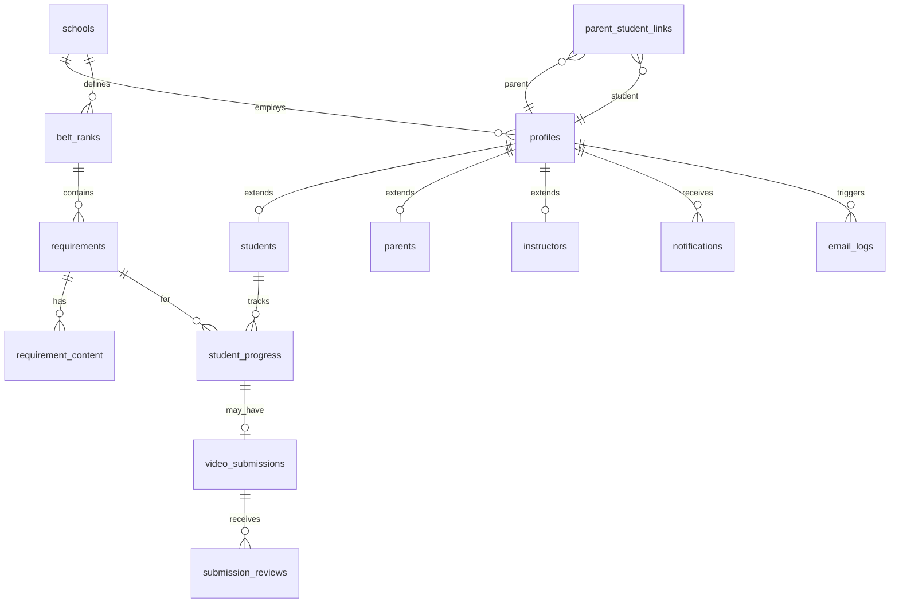

# Entity Relationship Diagram (Draft)

Phase 0 draft — implement in Supabase PostgreSQL during Phases 1–2.

## Core tables

### `profiles`
| Column | Type | Notes |
|--------|------|-------|
| id | uuid PK | = auth.users.id |
| role | enum | student, parent, instructor |
| full_name | text | |
| school_id | uuid FK | nullable for multi-school later |
| avatar_url | text | |

### `parent_student_links`
| Column | Type |
|--------|------|
| parent_id | uuid FK profiles |
| student_id | uuid FK profiles |
| relationship | text |

### `belt_ranks`
| Column | Type |
|--------|------|
| id | uuid |
| school_id | uuid |
| name | text |
| sort_order | int |
| color | text |

### `requirements`
| Column | Type |
|--------|------|
| id | uuid |
| belt_rank_id | uuid |
| type | enum | technique, form, self_defense, terminology, conditioning, leadership |
| title | text |
| description | text |

### `student_progress`
| Column | Type |
|--------|------|
| id | uuid |
| student_id | uuid |
| requirement_id | uuid |
| status | enum | not_started → attempted → parent_verified → submitted → approved / denied |
| parent_notes | text |
| instructor_feedback | text |
| updated_at | timestamptz |

### `video_submissions`
| Column | Type |
|--------|------|
| id | uuid |
| student_id | uuid |
| requirement_id | uuid |
| storage_path | text |
| duration_sec | int |
| parent_approved_at | timestamptz |
| instructor_reviewed_at | timestamptz |

## RLS summary (Phase 1)

- Students: own rows only
- Parents: linked students only
- Instructors: students in same school
